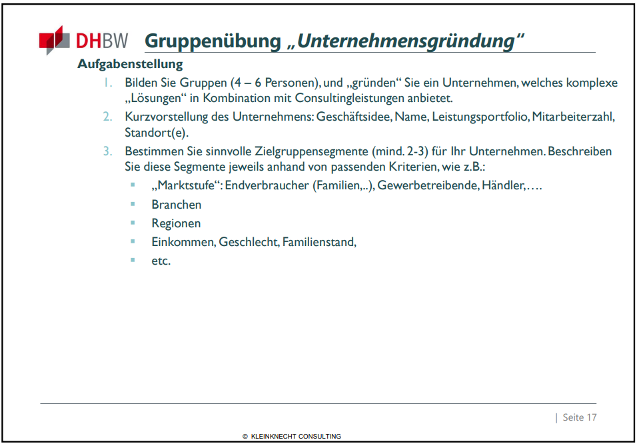

# Sonnengold Solutions

> Aufgabe 01

## Kurzvorstellung des Unternehmens ("Sonnengold Solutions"):
**Geschäftsidee:** Sonnengold Solutions ist ein Unternehmen, das auf maßgeschneiderte erneuerbare Energielösungen für große Unternehmen spezialisiert ist. Wir planen, entwickeln und implementieren Solarpanels und andere erneuerbare Energiequellen, um die Energiekosten zu senken, die Umweltauswirkungen zu reduzieren und nachhaltige Energielösungen für unsere Kunden anzubieten. Zusätzlich bieten wir Consulting-Services, um unsere Kunden bei der Optimierung ihrer Energieinfrastruktur und -strategie zu unterstützen.

**Name des Unternehmens:** Sonnengold Solutions GmbH

**Leistungsportfolio:**
- Maßgeschneiderte Solaranlagen und erneuerbare Energielösungen
  - Planung von Flächennutzung und Umwandlung
- Energieeffizienzberatung und -optimierung
- Projektmanagement für erneuerbare Energieprojekte
- Schulungen und Ressourcen zur nachhaltigen Energieverwaltung

**Mitarbeiterzahl:** Start mit 15 hochqualifizierten Mitarbeitern, darunter Ingenieure, Energieberater und Projektmanager.

**Standort(e):** Hauptsitz in Frankfurt, Deutschland, mit Niederlassungen in Berlin und München.
 
## Zielgruppensegmente:
### Große Industrieunternehmen:
- **Marktstufe:** Gewerbetreibende
- **Branchen:** Chemie, Automobilherstellung, Lebensmittelverarbeitung -> alle mit großen Flächen und Dächern
- **Regionen:** Deutschlandweit, mit Schwerpunkt auf industriellen Ballungsräumen.
- **Einkommen:** Unternehmen mit einem Jahresumsatz von über 100 Millionen Euro.
- **Entscheidungsträger:** Vorstandsmitglieder, Leiter der Nachhaltigkeitsabteilung, Energie- und Umweltmanager.
### Logistikunternehmen und Lagerhäuser:
- **Marktstufe:** Gewerbetreibende
- **Branchen:** Logistik, Lagerhaltung, E-Commerce.
  - Besonders vorteilhaft da große Dächer vorhanden sind, die unbenutzt sind
- **Regionen:** Deutschlandweit, insbesondere in Logistikzentren wie Frankfurt, Köln und Duisburg.
- **Einkommen:** Unternehmen mit einem Jahresumsatz von 10 Millionen Euro bis 50 Millionen Euro.
- **Entscheidungsträger:** Logistikleiter, Nachhaltigkeitsbeauftragte, Geschäftsführer.
### Kommunen und öffentliche Einrichtungen:
- **Marktstufe:** öffentliche Institutionen
- **Branchen:** Kommunal- & Stadtverwaltung, Schulen, Krankenhäuser.
- **Regionen:** Deutschlandweit, mit besonderem Fokus auf Städten und Gemeinden, spätere Ausbreitung nach Europa.
- **Einkommen:** Öffentliche Einrichtungen mit entsprechendem Budget für nachhaltige Energieprojekte.
- **Entscheidungsträger:** Bürgermeister, Stadtplaner, Energiekoordinatoren.
Unser Ansatz wird darin bestehen, maßgeschneiderte Angebote und Beratungsdienstleistungen für jede dieser Zielgruppen zu entwickeln, um ihren spezifischen Anforderungen gerecht zu werden und ihnen zu helfen, ihren Übergang zu erneuerbaren Energielösungen erfolgreich umzusetzen.
