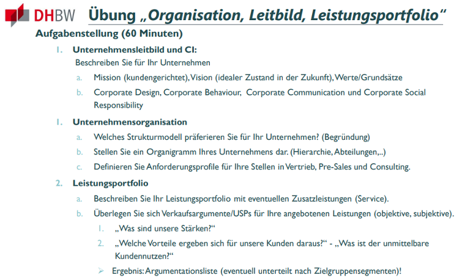
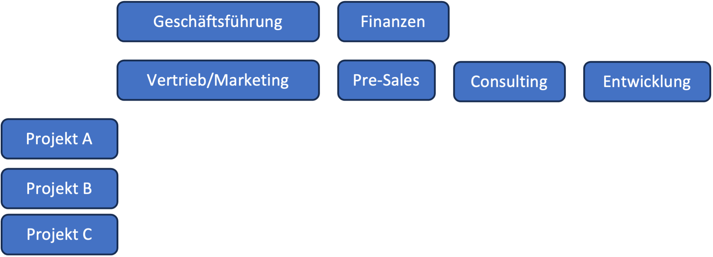

# A02: Unternehmensleitbild und CI

## Mission:
Unsere Mission ist es, Unternehmen bei der nachhaltigen Nutzung erneuerbarer Energielösungen zu unterstützen. Wir helfen unseren Kunden, umweltfreundlicher zu agieren und ihre Energiekosten zu senken, indem wir maßgeschneiderte erneuerbare Energielösungen entwickeln und implementieren. Durch die individual Lösungen ist es möglich, immer das beste Angebot dem Kunden zu bringen und so einen langfrisitigen Erfolg auf Kunden als auch unserer Seite zu ermöglichen.

## Vision:
Unsere Vision ist es, die treibende Kraft hinter der Verbreitung von erneuerbaren Energien in der Wirtschaft zu sein. Wir streben danach, eine Zukunft zu schaffen, in der Unternehmen auf nachhaltige Energiequellen umgestiegen sind und so aktiv zum Umweltschutz beitragen. In Zeiten in denen Energie, vor allem Industriestrom immer teuerer wird, haben die Kunden die Möglichkeit wirtschaftlicher zu agieren und eine From der Unabhängigkeit von äußeren Faktoren zu erreichen.

### Werte/Grundsätze:
- Qualität: Optimierung von Flächennutzung
- Innovation: Innovative Software zur Berrechnung der Flächennutzung
- Kundenzufriedenheit: Individuelle Kunden werden gezielt beraten
- Verantwortung/Nachhaltigkeit: Durch unser Geschäftsmodell tragen wir aktiv zur Zukunft unseres Planeten bei

### Corporate Identity:
- Corporate Design: Unser Corporate Design wird durch sonnige Farben, die Sonne als Symbol für erneuerbare Energie und saubere Linien geprägt sein.
- Corporate Behaviour: Wir legen Wert auf professionelles und ethisches Verhalten sowie eine offene Kommunikation mit Kunden und Mitarbeitern.
- Corporate Communication: Unsere Kommunikation wird transparent und kundenorientiert sein, um Vertrauen und Kundenzufriedenheit zu fördern.
- Corporate Social Responsibility: Durch unser Geschäftsmodell tragen wir aktiv zur Zukunft unseres Planeten bei

## Unternehmensorganisation:

### Strukturmodell:
Da in jedem Projekt ein neuer Kunde betreut wird, eignet sich für uns die Matrix-Organisationsstruktur. Sie ermöglicht es uns, die verschiedenen Projekte mit Mitarbeitern aus allen Abteilungen zu besetzen. Ein normaler Ablauf kann folgende Form haben:

### Organigramm:

### Anforderungsprofile:
- Vertrieb: Erfahrung im Verkauf erneuerbarer Energiesysteme, ausgezeichnete Kommunikationsfähigkeiten, Kundenorientierung.
- Pre-Sales: Technische Expertise in erneuerbaren Energietechnologien, Analysefähigkeiten, Präsentationskompetenz.
- Consulting: Fachkenntnisse in Energiemanagement, Projektmanagementfähigkeiten, Kundenberatungskompetenz.
- Entwicklung: Entwicklung an der Software und Forschung nach neuen Methoden

## Leistungsportfolio:

### Leistungsportfolio:
Unser Leistungsportfolio umfasst:
- Planung und Implementierung von Solaranlagen
- Energieeffizienzberatung
- Projektmanagement für erneuerbare Energieprojekte
- Schulungen und Ressourcen zur nachhaltigen Energieverwaltung
- Wartung und Service für erneuerbare Energiesysteme

### Verkaufsargumente/USPs:
- **Stärken:**
  1. Maßgeschneiderte Lösungen: Wir passen unsere Angebote an die spezifischen Anforderungen jedes Kunden an.
  2. Expertise: Unser Team besteht aus Fachleuten mit umfassendem Wissen über erneuerbare Energien.
  3. Nachhaltigkeit: Wir setzen auf umweltfreundliche Technologien und Praktiken.

- **Vorteile für Kunden:**
  1. Kostenersparnis: Unsere Lösungen senken die Energiekosten und bieten langfristige Einsparungen.
  2. Umweltauswirkungen: Wir unterstützen Kunden bei der Reduzierung ihres ökologischen Fußabdrucks.
  3. Zuverlässigkeit: Unsere maßgeschneiderten Lösungen bieten eine zuverlässige Energieversorgung.

<ins>Ergebnis:</ins> Eine umfassende Argumentationsliste, die je nach Zielgruppensegment angepasst werden kann, um den unmittelbaren Kundennutzen hervorzuheben.
