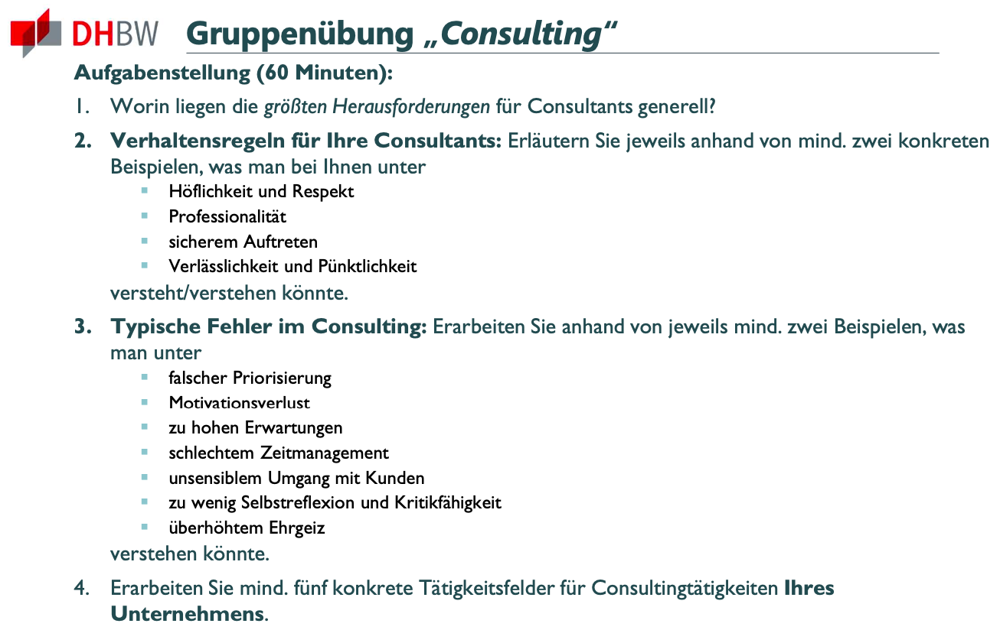

# A08 - Consulting

## 1. Größte Herausforderungen für Consultants genrell:
- **Komplexität der Aufgaben**: Berater müssen komplexe Problemstellungen verstehen und effektive Lösungen entwickeln.
- **Kundenbeziehung und Kommunikation**: Klare Kommunikation und die Fähigkeit, Kunden zu verstehen und deren Bedürfnisse zu erfüllen, sind entscheidend.
- **Schnelle Veränderungen**: Berater müssen sich kontinuierlich an neue Technologien, Marktbedingungen und Branchentrends anpassen.
- **Zeitmanagement**: Effiziente Nutzung der begrenzten Zeit, um Projekte erfolgreich abzuschließen.
- **Teamarbeit**: Koordination und Zusammenarbeit in multidisziplinären Teams sind erforderlich.

## 2. Verhaltensregeln für Consultants bei Sonnengold Solutions

### Höflichkeit und Respekt:
- Beispiel 1: Höflicher Umgang mit Kunden und Kollegen, um eine positive Arbeitsatmosphäre zu schaffen.
- Beispiel 2: Respektvoller Umgang mit unterschiedlichen Meinungen und kulturellen Hintergründen. 

### Professionalität:
- Beispiel 1: Pünktliches Erscheinen zu Kundenterminen und internen Meetings.
- Beispiel 2: Sorgfältige Vorbereitung und Präsentation von Beratungsergebnissen.

### Sicheres Auftreten:
- Beispiel 1: Überzeugende Kommunikation von Lösungsvorschlägen und Beratungskonzepten.
- Beispiel 2: Selbstbewusstes Auftreten bei Verhandlungen und Präsentationen.

### Verlässlichkeit und Pünktlichkeit:
- Beispiel 1: Einhalten von vereinbarten Projektmeilensteinen.
- Beispiel 2: Zuverlässige Bereitstellung von Informationen für Kunden und Teammitglieder.

## 3. Typische Fehler im Consulting bei Sonnengold Solutions:

### Falsche Priorisierung:
- Beispiel 1: Vernachlässigung von langfristigen strategischen Projekten zugunsten kurzfristiger, operativer Aufgaben.
- Beispiel 2: Überbetonung von operativen Aufgaben auf Kosten strategischer Initiativen.

### Motivationsverlust:
- Beispiel 1: Mangelnde Begeisterung für innovative Lösungen und nachhaltige Projekte.
- Beispiel 2: Unzureichende Kommunikation über die Bedeutung und Auswirkungen der durchgeführten Projekte.

### Zu hohe Erwartungen:
- Beispiel 1: Übertriebene Versprechen gegenüber Kunden bezüglich Zeitrahmen oder Ergebnissen.
- Beispiel 2: Unterschätzung der Komplexität von Projekten und daraus resultierende Enttäuschungen bei Kunden.

### Schlechtes Zeitmanagement:
- Beispiel 1: Verzögerungen bei Projektabschlüssen aufgrund unzureichender Planung.
- Beispiel 2: Überlastung von Mitarbeitern aufgrund unrealistischer Zeitpläne.

### Unsensibler Umgang mit Kunden:
- Beispiel 1: Mangelnde Empathie bei der Beratung von Kundenbedürfnissen.
- Beispiel 2: Unzureichende Kommunikation in kritischen Phasen von Projekten.

### Zu wenig Selbstreflexion und Kritikfähigkeit:
- Beispiel 1: Fehlen von kontinuierlichem Feedback und Lernbereitschaft.
- Beispiel 2: Unfähigkeit, aus vergangenen Projekten zu lernen und Prozesse zu verbessern.

### Überhöhter Ehrgeiz:
- Beispiel 1: Risikobehaftete Projekte ohne angemessene Ressourcenplanung und Risikobewertung.
- Beispiel 2: Ignorieren von Warnsignalen und Fortsetzung problematischer Projekte aus Ehrgeiz.

## 4. Tätigkeitsfelder für Consulting bei Sonnengold Solutions:
- **Energiestrategieberatung**: Entwicklung und Umsetzung von nachhaltigen Energiestrategien für Unternehmen. Welche Möglichkeiten gibt es? Welche sind sinnvoll? Gibt es Möglichkeiten im Unternehmen Energie einzusparen?
- **Technologieberatung**: Evaluierung und Integration neuer Technologien im Bereich erneuerbare Energien. Ist es sinnvoll eine bestehende Anlage zu verbessern? Kosten/Nutzenrechnung.
- **Finanzberatung**: Analyse von Finanzierungsoptionen für Investitionen in erneuerbare Energielösungen. Basierend auf möglichen Anlagen, wie können diese finanziert werden? Förderungen durch die Regierung. 
- **Nachhaltigkeitsberatung**: Implementierung von umweltfreundlichen Praktiken und Nachhaltigkeitszielen. 
